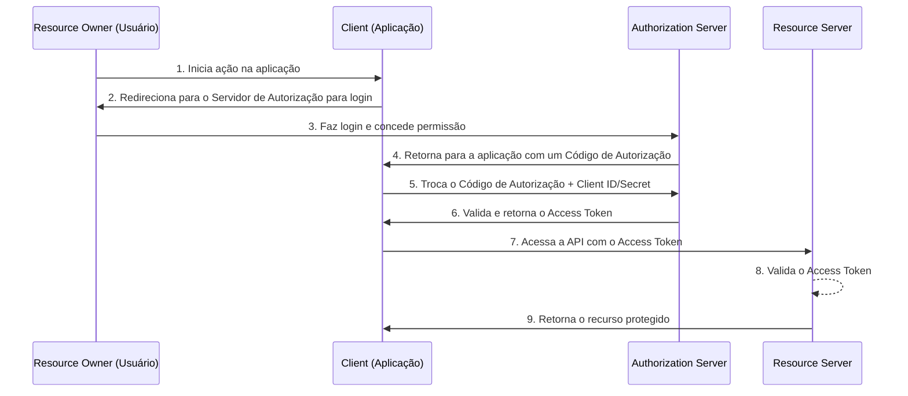

## OAuth 2.0 e JWT: Desvendando a Autorização Moderna na Web

O OAuth 2.0 é um protocolo de autorização amplamente utilizado que permite que aplicativos de terceiros obtenham acesso limitado a recursos de um usuário em um servidor HTTP, sem a necessidade de expor as credenciais do usuário. Em conjunto com o JSON Web Token (JWT), ele oferece uma solução robusta e segura para controle de acesso em APIs e serviços web modernos.

Esta explicação detalha o funcionamento do protocolo OAuth 2.0 e como ele se integra com o JWT para fornecer autorização baseada em tokens.

### Entendendo os Papéis no Ecossistema OAuth 2.0

Para compreender o OAuth 2.0, é fundamental conhecer os quatro papéis principais envolvidos no processo de autorização:

* **Resource Owner (Dono do Recurso):** É o usuário final que possui os dados e concede permissão para que um aplicativo acesse seus recursos. Por exemplo, o dono de um perfil em uma rede social.
* **Client (Cliente):** É o aplicativo que deseja acessar os recursos do *Resource Owner*. Pode ser uma aplicação web, um aplicativo móvel ou um serviço de backend.
* **Authorization Server (Servidor de Autorização):** É o servidor responsável por autenticar o *Resource Owner* e emitir os *Access Tokens* (Tokens de Acesso) após obter o consentimento do usuário.
* **Resource Server (Servidor de Recursos):** É o servidor que hospeda os recursos protegidos do *Resource Owner* e que aceita e valida os *Access Tokens* para conceder acesso ao *Client*.

### O Fluxo do OAuth 2.0: Como a Autorização Acontece

O OAuth 2.0 define vários fluxos de autorização, conhecidos como "Grant Types", adequados para diferentes tipos de aplicações. O mais comum e seguro para aplicações web é o **"Authorization Code Grant" (Concessão por Código de Autorização)**. Veja como ele funciona passo a passo:

1.  **Solicitação de Autorização:** O *Client* redireciona o *Resource Owner* para o *Authorization Server* com um link que inclui o `client_id`, o `redirect_uri` (para onde o usuário será enviado de volta após a autorização), o `response_type` (definido como `code`) e o `scope` (o nível de acesso que o aplicativo está solicitando).

2.  **Concessão do Usuário:** O *Authorization Server* apresenta uma tela de consentimento ao *Resource Owner*, informando quais permissões o *Client* está solicitando. Se o usuário concordar, ele autoriza o acesso.

3.  **Geração do Código de Autorização:** Após a autorização, o *Authorization Server* redireciona o *Resource Owner* de volta para o *Client* (no `redirect_uri` especificado) com um **código de autorização** temporário.

4.  **Troca do Código pelo Access Token:** O *Client*, agora em posse do código de autorização, faz uma requisição de *backend* para o *Authorization Server*. Essa requisição inclui o código de autorização, o `client_id` e o `client_secret` (uma credencial secreta do cliente).

5.  **Emissão do Access Token:** O *Authorization Server* verifica o código de autorização, o `client_id` e o `client_secret`. Se tudo estiver correto, ele emite um **Access Token** e, opcionalmente, um **Refresh Token**, e os envia para o *Client*.

6.  **Acesso aos Recursos Protegidos:** O *Client* pode agora utilizar o *Access Token* para fazer requisições ao *Resource Server* e acessar os recursos protegidos em nome do *Resource Owner*. O token é geralmente enviado no cabeçalho `Authorization` da requisição HTTP como um "Bearer token".

7.  **Validação do Access Token:** O *Resource Server* recebe a requisição com o *Access Token* e precisa validá-lo. É neste ponto que a integração com o JWT se torna crucial.

-------------------
#### Explicação Em vídeo
  [Aprenda](http://www.youtube.com/watch?v=68azMcqPpyo "Video Title")

### Integrando com JWT: O Token de Acesso Inteligente

Enquanto o OAuth 2.0 define o fluxo de autorização, ele não especifica o formato do *Access Token*. É aqui que o **JSON Web Token (JWT)** entra em cena, sendo um formato popular e eficiente para a criação de *Access Tokens*.

Um JWT é um padrão aberto (RFC 7519) que define uma maneira compacta e autossuficiente de transmitir informações de forma segura entre as partes como um objeto JSON. Um JWT é composto por três partes, separadas por pontos (`.`):

* **Header (Cabeçalho):** Contém metadados sobre o token, como o tipo de token (`typ`, que é "JWT") e o algoritmo de assinatura utilizado (`alg`, como `HS256` ou `RS256`).
* **Payload (Carga Útil):** Contém as "claims" (reivindicações), que são declarações sobre uma entidade (normalmente, o usuário e as permissões do token). Existem claims registradas (como `iss` - emissor, `exp` - tempo de expiração, `sub` - assunto/ID do usuário) e claims personalizadas.
* **Signature (Assinatura):** Para garantir a autenticidade e a integridade do token, o cabeçalho e a carga útil são assinados digitalmente pelo *Authorization Server* usando uma chave secreta (no caso do `HS256`) ou um par de chaves pública/privada (no caso do `RS256`).

#### Como o OAuth 2.0 usa o JWT

Quando um *Authorization Server* emite um *Access Token* no formato JWT, ele inclui no *payload* as informações necessárias para que o *Resource Server* possa validar o token e autorizar a requisição. As *claims* essenciais em um *Access Token* JWT para OAuth 2.0 incluem:

* `iss` (Issuer): Quem emitiu o token (o *Authorization Server*).
* `sub` (Subject): O identificador do *Resource Owner*.
* `aud` (Audience): O(s) *Resource Server(s)* para o qual o token se destina.
* `exp` (Expiration Time): O tempo de vida do token. Após este tempo, o token é inválido.
* `iat` (Issued At): A data e hora em que o token foi emitido.
* `scope`: As permissões (escopos) que foram concedidas pelo *Resource Owner*.

#### Validação do Access Token JWT pelo Resource Server

Quando o *Resource Server* recebe uma requisição com um *Access Token* JWT, ele realiza as seguintes verificações para validá-lo:

1.  **Verificação da Assinatura:** O *Resource Server* utiliza a chave pública (no caso de algoritmos assimétricos como o `RS256`) ou a chave secreta compartilhada (para algoritmos simétricos como o `HS256`) para verificar se a assinatura do JWT é válida. Isso garante que o token foi realmente emitido pelo *Authorization Server* e não foi adulterado.

2.  **Validação das Claims:** O *Resource Server* verifica as *claims* no *payload* do JWT:
    * Verifica se o token não expirou (comparando o `exp` com o tempo atual).
    * Verifica se o `iss` corresponde ao *Authorization Server* confiável.
    * Verifica se ele mesmo está incluído na *claim* `aud`.
    * Verifica se o `scope` do token concede permissão para a operação solicitada.

Se todas as verificações forem bem-sucedidas, o *Resource Server* considera a requisição autorizada e processa a solicitação.

### Vantagens de Usar OAuth 2.0 com JWT

* **Stateless (Sem Estado):** Como o JWT contém todas as informações necessárias para a validação, o *Resource Server* não precisa armazenar informações sobre os tokens em seu próprio banco de dados, tornando a arquitetura mais escalável e simples.
* **Desacoplamento:** O *Resource Server* e o *Authorization Server* não precisam se comunicar diretamente para validar um token (no caso de uso de chaves assimétricas), o que reduz a latência e a dependência entre os serviços.
* **Segurança:** A assinatura digital garante a integridade e a autenticidade do token.
* **Flexibilidade:** As *claims* personalizadas permitem a inclusão de informações adicionais no token, como papéis do usuário, níveis de acesso, etc.

Em resumo, a combinação do fluxo de autorização bem definido do OAuth 2.0 com a estrutura de token autossuficiente e segura do JWT cria um padrão poderoso e flexível para a gestão de acesso em aplicações modernas, garantindo que os dados dos usuários sejam acessados de forma segura e controlada.